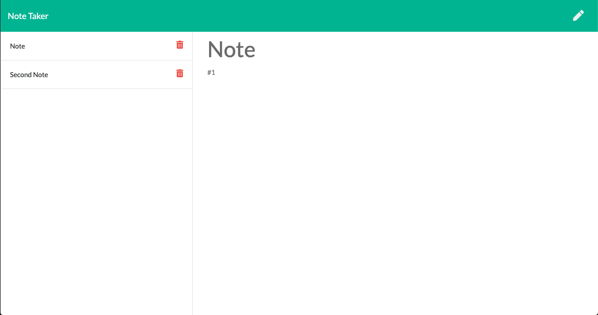

# Note Taker
1. [ Description. ](#desc)
2. [ Questions.](#ques)
3. [ Link to app.](#link)
4. [ Screenshot.](#scrsh)

## Description:
### Note Taker can write and save notes. This application  uses an Express.js back end and will save and retrieve note data from a JSON file.

## Questions:
### My gitHub profile:
## https://github.com/Alex2055
### Email me:
## alexfromnashville@gmail.com

### Link to deployed application:
https://min-eureka-vasilkov.herokuapp.com

 #
 

    
